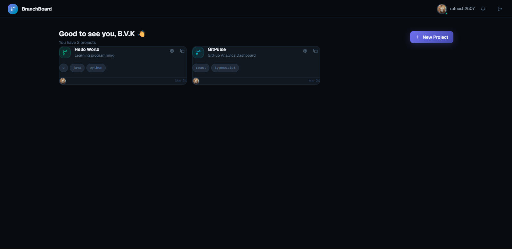
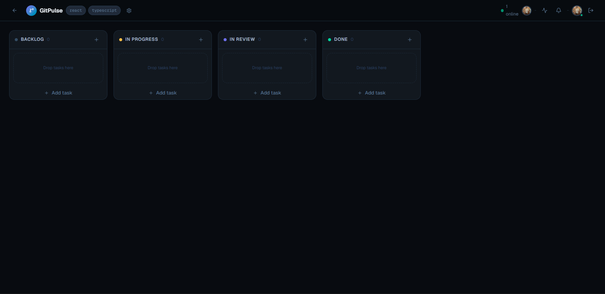
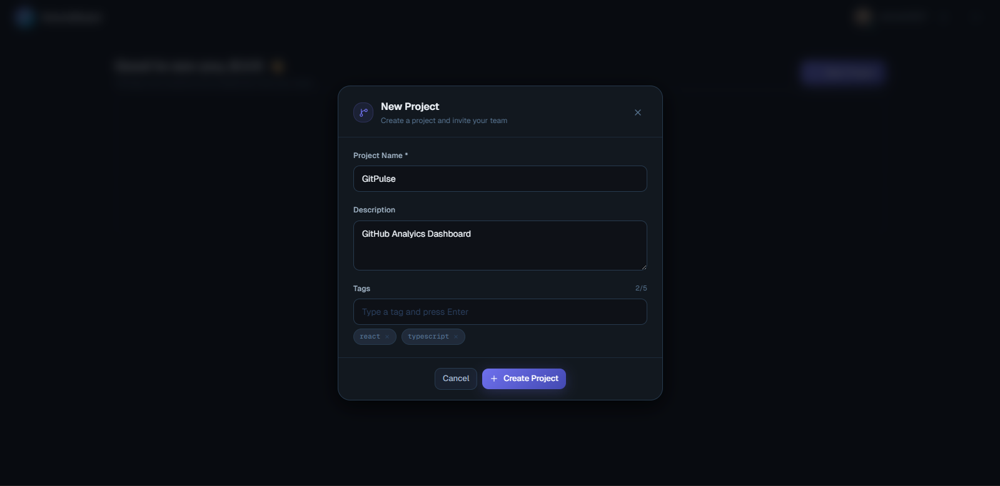
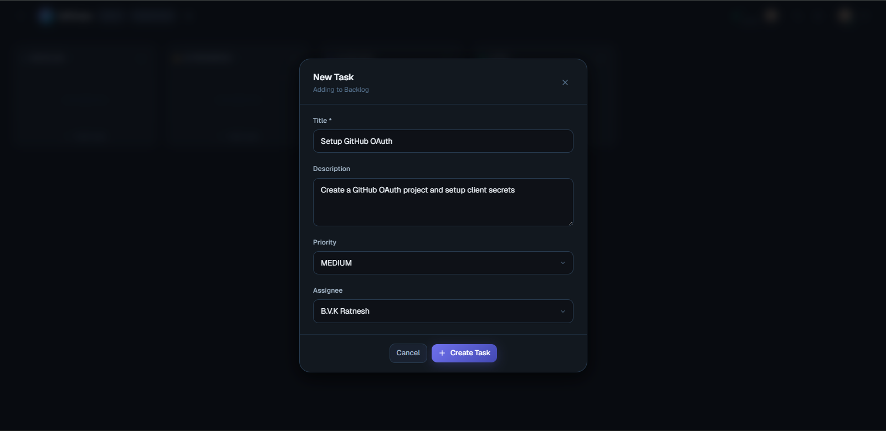
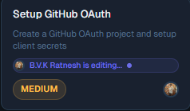
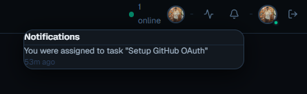
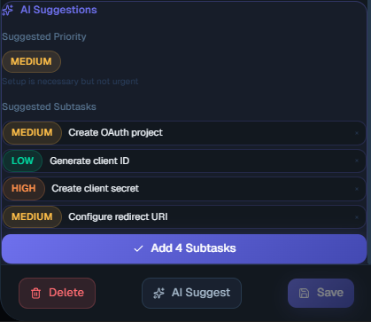
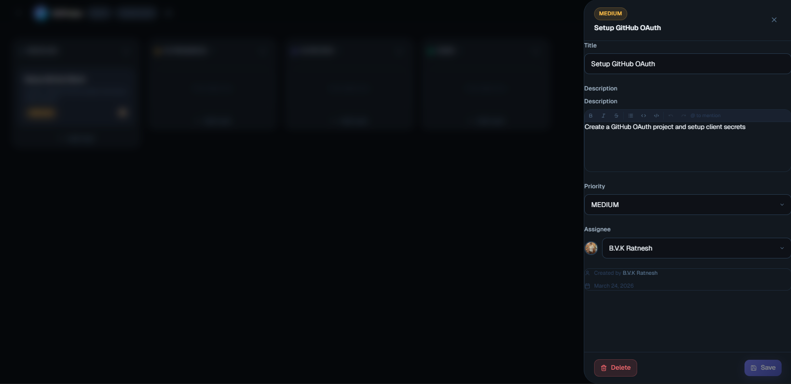

# BranchBoard

> A real-time developer collaboration platform built for developers — Kanban boards, live presence, rich text tasks, and instant sync via WebSockets.


## 🌐 Live Demo

- **App:** https://branch-board.vercel.app/
- **Backend API:** https://branchboard.onrender.com/

## 📸 Screenshots

| Dashboard                                     | Board                                 |
| --------------------------------------------- | ------------------------------------- |
|  |  |

| New Project                                       | Task Detail                             |
| ------------------------------------------------- | --------------------------------------- |
|  |  |

| Live Editing Presence                                   | Notifications                                         |
| ------------------------------------------------------- | ----------------------------------------------------- |
|  |  |

| AI Suggestions                                  | Rich Text Editor                              |
| ----------------------------------------------- | --------------------------------------------- |
|  |  |

| Activity Feed                                    |
| ------------------------------------------------ |
|  |

## ✨ Features

### 🔐 Authentication & Access

- GitHub OAuth — one-click sign in with your GitHub account
- Secure JWT authentication via httpOnly cookies (cross-origin safe)
- Shareable invite links for project onboarding

### 📋 Project & Task Management

- Create projects and invite teammates via shareable links
- Kanban boards — Backlog → In Progress → In Review → Done
- Full task lifecycle — create, edit, delete, assign, prioritize
- **Optimistic UI** — drag & drop updates instantly, rolls back automatically on error
- Persistent column ordering and task positions

### ⚡ Real-Time Collaboration

- Live task updates via Socket.IO — no polling, no page refreshes
- **Live editing presence** — see exactly who is editing a task right now
- Online member count and presence indicators
- Activity feed with granular per-action tracking

### ✍️ Rich Text & Mentions

- **Tiptap editor** — bold, italic, strikethrough, bullet lists, inline code, syntax-highlighted code blocks
- **@mentions** — tag teammates directly in task descriptions
- Mention notifications delivered in real time to the notification bell
- Undo/redo history in the editor

### 🧪 Testing & Quality

- Backend API tested with **Jest + Supertest** — task CRUD, auth guards, 403/404 coverage
- Full TypeScript strict mode on both frontend and backend
- Input validation with Zod on every API endpoint

### 🔄 CI/CD

- **GitHub Actions** pipeline — lint, typecheck, and tests run on every push and PR
- Separate `tsconfig.build.json` for production builds (excludes test/mock files)
- Render auto-deploys on merge to main

## 🛠 Tech Stack

### Frontend

| Technology          | Purpose                                    |
| ------------------- | ------------------------------------------ |
| React 19 + Vite     | UI framework                               |
| TypeScript (strict) | Type safety                                |
| Tailwind CSS v4     | Styling                                    |
| TanStack Query v5   | Data fetching, caching, optimistic updates |
| Zustand             | Auth state                                 |
| dnd-kit             | Drag and drop                              |
| Tiptap              | Rich text editor                           |
| Socket.IO Client    | Real-time updates                          |
| React Router v7     | Routing                                    |

### Backend

| Technology             | Purpose            |
| ---------------------- | ------------------ |
| Node.js + Express v5   | Server             |
| TypeScript (strict)    | Type safety        |
| Prisma v7              | ORM                |
| PostgreSQL (Supabase)  | Database           |
| Socket.IO              | WebSockets         |
| JWT + httpOnly cookies | Authentication     |
| Zod                    | Request validation |
| Jest + Supertest       | API testing        |

## 🏗 Architecture

```
Frontend (Vercel)
      ↓  REST + httpOnly cookies
Backend (Render)
      ↓  Prisma ORM
Supabase (PostgreSQL)

Frontend ←→ Backend (Socket.IO WebSocket)
```

**Key decisions:**

- Backend owns all auth — the frontend never touches JWTs directly
- Supabase used as a managed Postgres host with connection pooling (no direct client access)
- Socket.IO rooms per project — events are scoped, not broadcast globally
- Optimistic updates via TanStack Query `onMutate`/`onError` — UI updates instantly, rolls back on server error without a refetch flicker

## 🚀 Getting Started

### Prerequisites

- Node.js 22+
- A GitHub account (for OAuth)

### 1. Clone the repository

```bash
git clone https://github.com/ratnesh2507/collab-platform.git
cd collab-platform
```

### 2. Backend setup

```bash
cd backend
npm install
```

Create `backend/.env`:

```env
DATABASE_URL=your_supabase_pooled_url
DIRECT_URL=your_supabase_direct_url
JWT_SECRET=your_secret
FRONTEND_URL=http://localhost:5173
BACKEND_URL=http://localhost:5000
PORT=5000
GITHUB_CLIENT_ID=your_client_id
GITHUB_CLIENT_SECRET=your_client_secret
```

### 3. Frontend setup

```bash
cd frontend
npm install
```

Create `frontend/.env`:

```env
VITE_API_URL=http://localhost:5000
VITE_APP_URL=http://localhost:5173
```

### 4. Database setup

```bash
cd backend
npx prisma db push
npx prisma generate
```

### 5. GitHub OAuth App (local dev)

1. Go to **GitHub → Settings → Developer Settings → OAuth Apps → New OAuth App**
2. Set **Homepage URL** to `http://localhost:5173`
3. Set **Authorization callback URL** to `http://localhost:5000/api/auth/github/callback`
4. Copy **Client ID** and **Client Secret** into `backend/.env`

> For production, create a separate OAuth app pointing to your deployed URLs.

### 6. Run the project

```bash
# Terminal 1 — Backend
cd backend && npm run dev

# Terminal 2 — Frontend
cd frontend && npm run dev
```

Visit `http://localhost:5173` and sign in with GitHub.

### 7. Run tests

```bash
cd backend && npm test
```

## 📁 Project Structure

```
collab-platform/
├── .github/
│   └── workflows/
│       └── ci.yml              # Lint, typecheck, test pipeline
├── frontend/
│   └── src/
│       ├── components/
│       │   ├── board/          # Board, TaskCard, TaskDetailPanel, Modals
│       │   ├── projects/       # ProjectCard, CreateProjectModal
│       │   └── ui/             # NotificationBell, RichTextEditor
│       ├── hooks/              # useAuth, useProjects, useTasks, useNotifications
│       ├── lib/                # api.ts, socket.ts
│       ├── pages/              # Landing, Dashboard, Board, Invite
│       ├── store/              # authStore (Zustand)
│       └── types/              # TypeScript interfaces
└── backend/
    └── src/
        ├── controllers/        # auth, project, task, notification
        ├── middleware/         # authenticate middleware
        ├── routes/             # auth, project, task, notification routes
        ├── socket/             # Socket.IO event handlers + presence
        ├── lib/                # prisma.ts, jwt.ts
        ├── __tests__/          # Jest + Supertest API tests
        └── __mocks__/          # Prisma mock for testing
```

## 📄 License

MIT — Built by [ratnesh2507](https://github.com/ratnesh2507)
